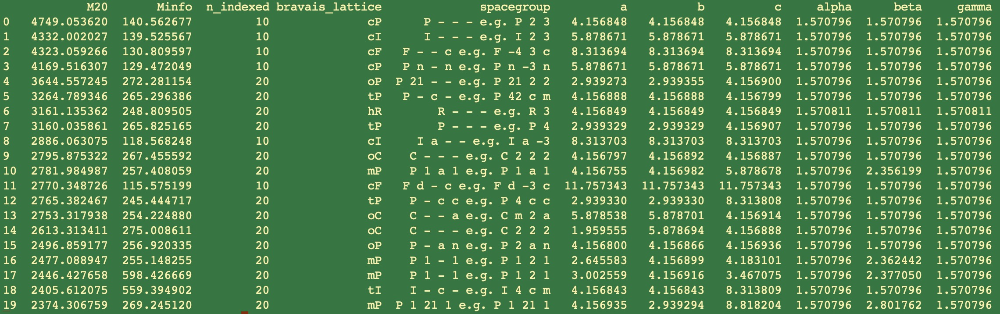

# MLINDEX - A data driven approach to powder diffraction indexing

A powder diffraction indexing program that uses machine learning models to initialize the SVD-Index algorithm. It takes an input peak list and returns a list of unit cells ranked by Figure of Merit.

> **Note:** The paper describing the methods is currently in submission to the Journal of Applied Crystallography. This application is in beta stage. Usage and feedback would be greatly appreciated to improve user experience.

## Installation

Currently the only way to install the program is by cloning the repository. The machine learning models take roughly 1 GB of hard-drive space and are version controlled through [git-lfs](https://www.git-lfs.com). You will need to install git-lfs to download the models from GitHub.

### Prerequisites
- Git LFS installed on your system
- Conda environment (recommended)

### Installation Steps

1. **Clone the repository:**
   ```bash
   git clone git@github.com:dwmoreau/MLI.git
   ```

2. **Retrieve the large files:**
   ```bash
   git lfs fetch --all
   git lfs checkout
   ```

3. **Install the project:**
   ```bash
   cd /path/to/the/cloned/repo
   pip install .
   ```

## Usage

### Peak List Generation

Peak list files generated by GSAS-II can be used directly. GSAS-II provides tutorials for creating peak lists:
- [GSAS-II Fit Peaks Tutorial](https://advancedphotonsource.github.io/GSAS-II-tutorials/FitPeaks/Fit%20Peaks.htm)

Alternatively, provide the d-spacings of the observed diffraction peaks in units of q², which is simply 1/resolution². Save this list to a numpy array.

### Code Execution

#### Using GSAS-II pkslst files
When using a GSAS-II pkslst file, you must supply the wavelength:

```bash
mlindex.run --peak-file /path/to/your/file/11bmb_3844.pkslst --wavelength 0.413128
```

#### Using numpy arrays
When using a numpy array, the wavelength option is ignored:

```bash
mlindex.run --peak-file /path/to/your/file/11bmb_3844.npy
```

#### Parallel Execution
The examples above run serially. For parallel execution using MPI (currently supports six processes):

```bash
mpiexec -n 6 mlindex.run --peak-file /path/to/your/file/11bmb_3844.pkslst --wavelength 0.413128
```

### Results Interpretation

The program outputs the top 20 unit cell candidates ranked by M20 score:



#### Column Descriptions

| Column | Description |
|--------|-------------|
| **M20** | de Wolff Figure of Merit (Wolff 1968) |
| **Minfo** | Figure of Merit from Taupin (1988) |
| **n_indexed** | Number of indexed peaks, using a probability from Taupin (1988) and a 95% threshold |
| **bravais lattice** | Assumed Bravais lattice for the unit cell optimization |
| **spacegroup** | Spacegroup whose systematic absences best align with the observed peak list |

## Acknowledgements

The US Department of Energy Integrated Computational and Data Infrastructure for Scientific Discovery supported this work via grant DE-SC0022215 to Aaron S. Brewster (LBL), Tess Smidt (MIT), and Nate Hohmann (UCONN).

## Citations

- Taupin, D. (1988). *J. Appl. Cryst.* **21**, 485-489.
- Wolff, P. M. D. (1968). *J. Appl. Cryst.* **1**, 108.
